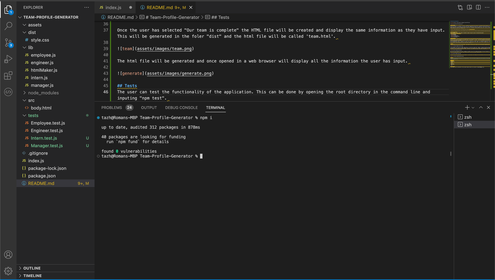
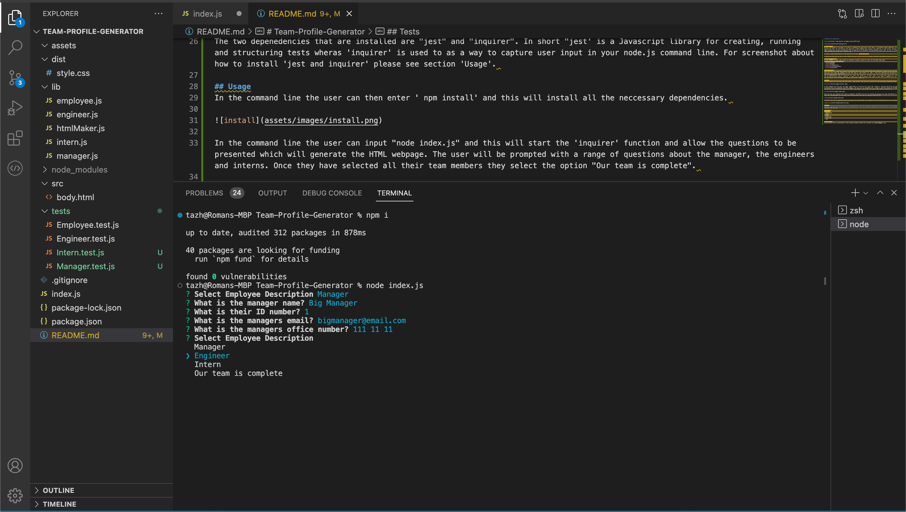
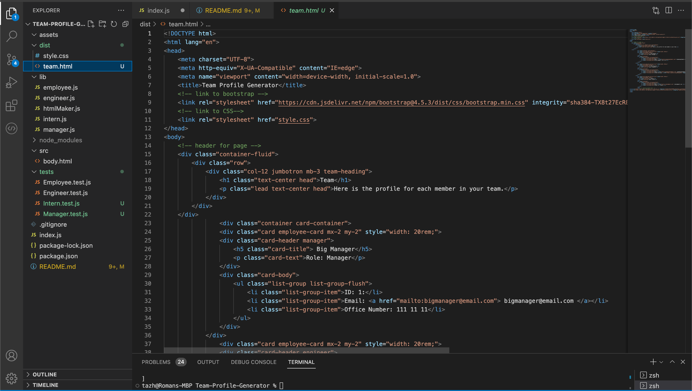
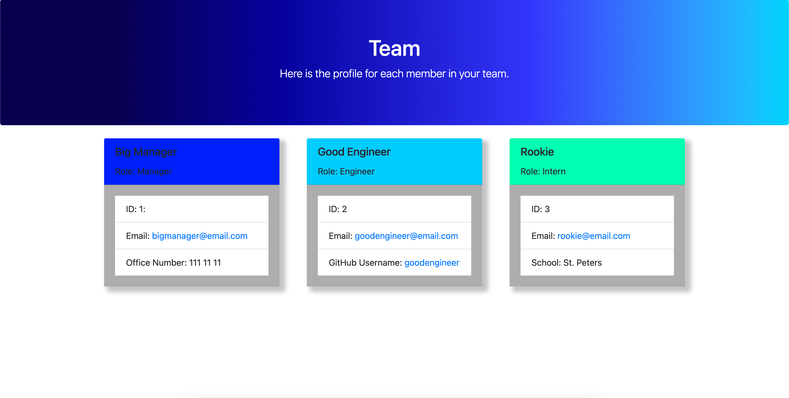

# Team-Profile-Generator

## Description
We were challenged to use Node.js to build a command-line application that takes in information about employess on a software engineering team. The information then generates a HTML webpage that displays the summaries of each person. Having recently learnt about testing this project provided me with an opporuntiy to implement testing methods using 'jest' as well as further develop my understanding and skills with 'inquirer'. 

To view a video demonstation of the application please [CLICK HERE.](https://drive.google.com/file/d/1lDEumC-wFlzy-11WQD0mdaJj89QGhfNp/view) 

To view the code and see how it was created view my [GitHub repo here.](https://github.com/tajdinov/Team-Profile-Generator.git) 

## Table of Contents
If your README is long, add a table of contents to make it easy for users to find what they need.
- [Installation](#installation)
- [Usage](#usage)
- [Tests](#tests)
- [Features](#features)
- [Contribute](#contribute)

## Installation
Once the user has cloned the project from GitHub there are a very steps they must undertake in order to get the application running. 
They must first open the command line and then type in 'npm install' or 'npm i'. This will download the neccessary dependencies so that the application functions. 
The two depenedencies that are installed are "jest" and "inquirer". In short "jest' is a Javascript library for creating, running and structuring tests wheras 'inquirer' is used to as a way to capture user input in your node.js command line. For screenshot about how to install 'jest and inquirer' please see section 'Usage'. 

## Usage
In the command line the user can then enter ' npm install' and this will install all the neccessary dependencies. 

In the command line the user can input "node index.js" and this will start the 'inquirer' function and allow the questions to be presented which will generate the HTML webpage. The user will be prompted with a range of questions about the manager, the engineers and interns. Once they have selected all their team members they select the option "Our team is complete". 

Once the user has selected "Our team is complete" the HTML file will be created and display the same information as they have input. This will be generated in the foler "dist" and the html file will be called 'team.html'. 

The html file will be generated and once opened in a web browser will display all the information the user has input. 

## Tests
The user can test the functionality of the application. This can be done by opening the root directory in the command line and inputing "npm test". 

## Features
- Node.js
- Javascript
- HTML 
- CSS 
- Bootstrap
- Inquirer 
- Jest

